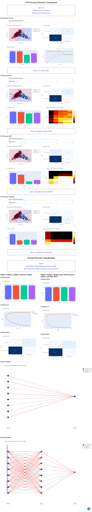

# ML-Data-Visualization

## Origin

I'm currently in fifth semester of my cs bachelor in University Leipzig in Germany. This repository is used to contain the code of the data visualization app (dash) which is one of my courses. This is supposed to be a group work, you should be able to see the contributions somehow. 

I use plotly to build visualization part and sklearn for machine learning, this is also requirement of this course.

## Example

## To be updated

I hope I will use this starting point to develop and gain more knowledge about ML and data visualization.